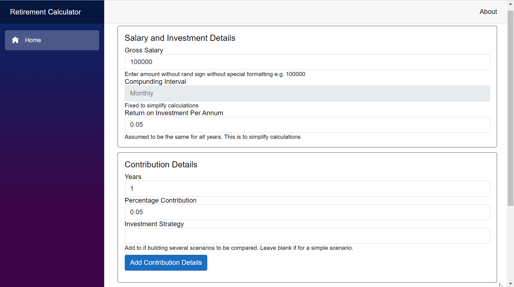
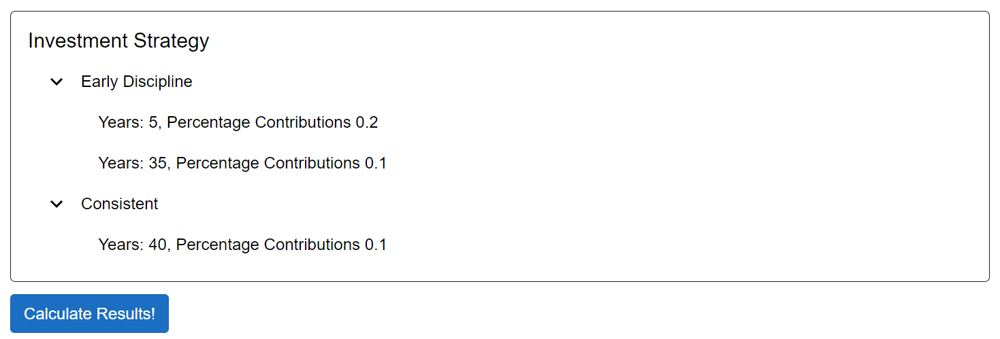
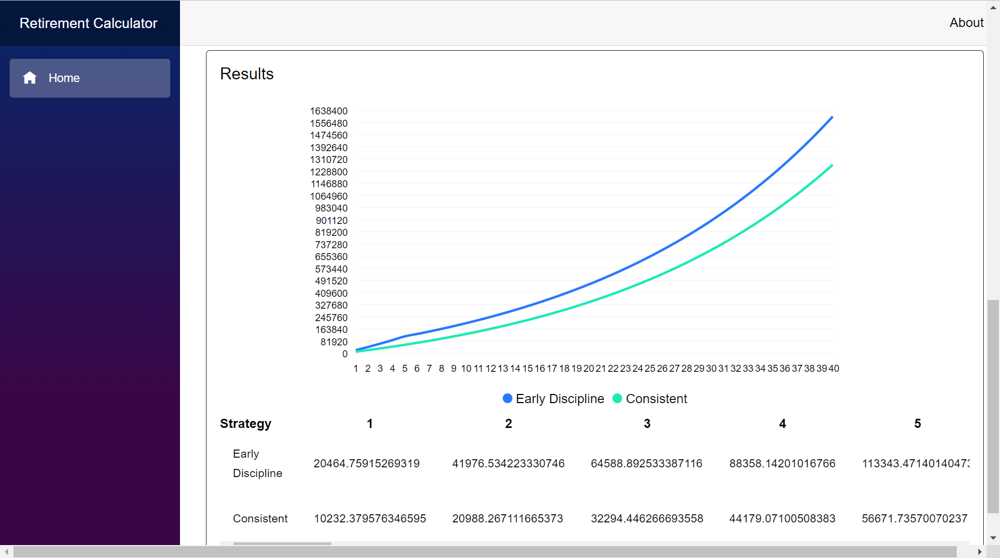

# RetirementCalculator

## TLDR
This is a fun application which gives users a graphical illustration of how their choices for retirement contributions affect their lump sums for retirement retirement.

Users can set assumptions for their salary, return on invesment and set various investment strategies

You can add various invesment profiles by setting up contribution details e.g. 15% for 5 years and 10% for 35. As an example, the image below shows the strategies set up.

The results can then be viewed

## More info

## Problem Statement
It's difficult to visualise how contributions you make today affect your retirement in 40 years from now.

This application allows you to set your contributions for X years and arbitrarily change it for various intervals.

The application addresses the following issue.
> I currently contribute X% to my retirement
> savings. 
>
> If it was possible to contribute X  + 10% 
> for 5 years and then X% for the rest of my
> career, how much would this affect my final
> retirement contributions?

## The Technical Stuff
- The current current implementation uses a rust rest API and a blazor front end. 
## Resources

Useful guides for referencing in future

### Rust
- [Setting up Rust in VS Code](https://www.twelve21.io/getting-started-with-rust-on-windows-and-visual-studio-code/#:~:text=Interestingly%20enough%2C%20the%20Rust%20compiler%20requires%20the%20Microsoft,the%20Visual%20Studio%20Build%20Tools%202019%20version%20here.)
- [Language Intro](https://doc.rust-lang.org/book/ch00-00-introduction.html)